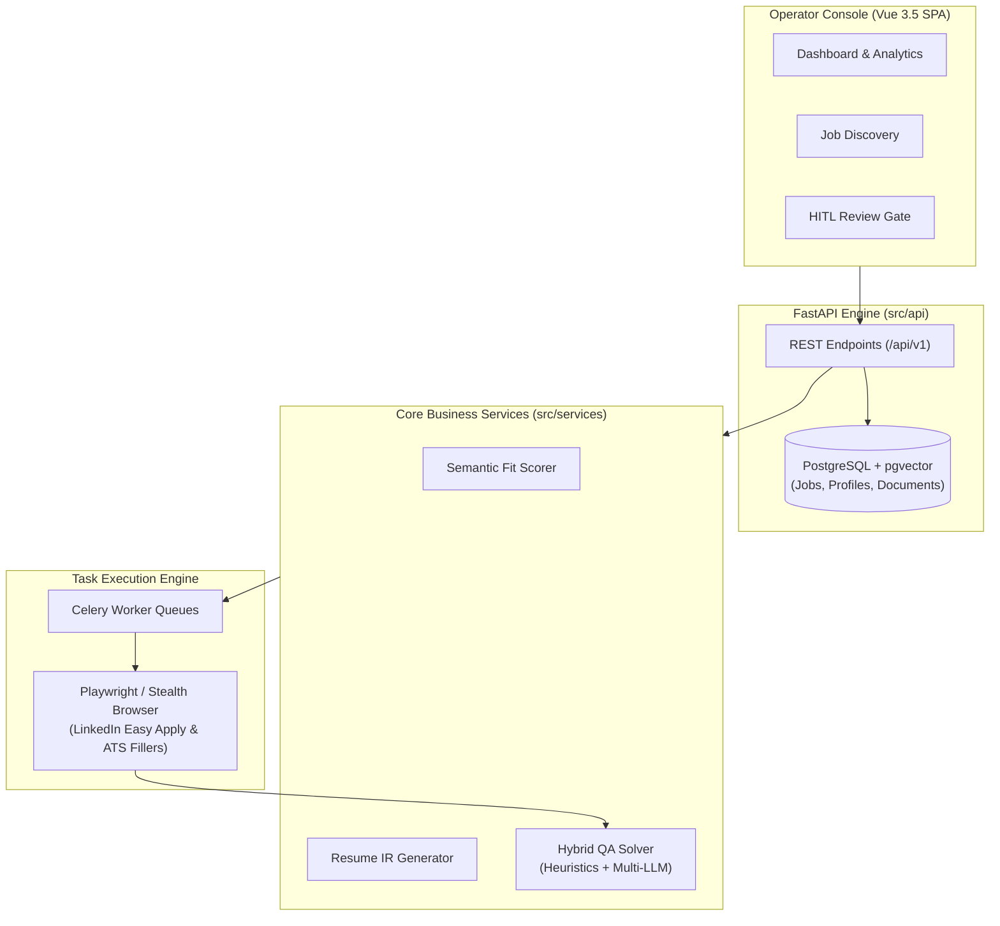

# 🚀 LazyHire - AI-Powered Job Application Automation Workspace

<p align="center">
  
  
  
  
  
  
</p>

**LazyHire** is a local-first, AI-powered job application discovery, resume tailoring, and automated browser submission workspace. It unifies intelligent job intake, `pgvector` semantic fit scoring, dynamically tailored resume/cover letter generation, Human-in-the-Loop (HITL) review gates, and stealth browser automation for LinkedIn Easy Apply and top ATS platforms (Greenhouse, Lever, Ashby).

---

## 📊 Current Project Status (~25% Completed)

The **Phase 1 Foundation & Architecture Setup** is complete and fully verified with unit tests passing:

- ✅ **Backend Engine**: FastAPI async server (`src/main.py`) with environment-based Pydantic settings.
- ✅ **Database & ORM**: PostgreSQL / SQLite async engine with SQLAlchemy 2.0 models (`JobPosting`, `CandidateProfile`, `TailoredDocument`, `JobApplication`, `LLMProviderConfig`).
- ✅ **API Schemas & Layer**: Standardized Pydantic v2 schemas and v1 endpoints (`/health`, `/jobs`, `/profiles`, `/materials`, `/review`, `/applications`, `/providers`).
- ✅ **Modular Architecture**: Base interfaces for LLM Providers, Execution Runners, Hybrid QA Solver, and Celery Workers.
- ✅ **Test Suite**: Automated Pytest suite (`tests/test_health.py`) passing 100%.

---

## 🎯 Feature Roadmap: What Needs To Be Added (Remaining ~75%)

Below is the complete breakdown of features to implement across the remaining project phases:

```mermaid
gantt
    title LazyHire Development Roadmap
    dateFormat  YYYY-MM-DD
    section Completed
    Phase 1: Project Foundation & API :done, p1, 2026-10-04, 2026-10-05
    section Remaining Features
    Phase 2: Job Intake & Scraper     :p2, 2026-10-06, 3d
    Phase 3: Semantic Fit Scoring     :p3, after p2, 3d
    Phase 4: Multi-LLM Provider Engine:p4, after p3, 3d
    Phase 5: Resume & Cover Letter IR :p5, after p4, 4d
    Phase 6: Live Stealth Form Filler :p6, after p5, 5d
    Phase 7: Vue 3.5 Operator Console :p7, after p6, 4d
```

### 🔹 Phase 2: Intelligent Job Discovery & Intake Engine
- [ ] **LinkedIn Search Scraper**: Playwright browser fetcher for LinkedIn keywords, locations, and Easy Apply filter toggle.
- [ ] **ATS Platform Parsers**: Custom parsers for Greenhouse (`boards.greenhouse.io`), Lever (`jobs.lever.co`), Ashby, and Workday job descriptions.
- [ ] **Job Normalization & Snapshot Storage**: Deduplicate postings by external ID and store raw snapshots into PostgreSQL.

### 🔹 Phase 3: Semantic Fit Scoring & Matching
- [ ] **Hard Filter Rules**: Exclude blacklisted companies, non-matching experience levels, and non-sponsoring roles.
- [ ] **Vector Embedding Matching (`pgvector`)**: Compute cosine similarity scores between candidate profile embeddings and job description requirements.
- [ ] **Explainability Breakdown**: Generate structured JSON match reasons (`skills_match`, `missing_keywords`, `seniority_score`).

### 🔹 Phase 4: Multi-LLM Provider Engine & Rate Limiter
- [ ] **Provider Adapters**: Full integrations for OpenAI, Anthropic (Claude), Google Gemini, DeepSeek, Ollama (local), and OpenRouter.
- [ ] **Process-Wide Rate Limiting**: Global and per-provider RPM limits with automatic queue throttling.
- [ ] **Token & Cost Telemetry**: Track prompt/completion tokens and dollar costs per task/agent.

### 🔹 Phase 5: Resume & Cover Letter Tailoring Engine
- [ ] **Intermediate Representation (IR)**: Structured resume IR builder that aligns candidate memory facts to job description keywords.
- [ ] **Fact-Drift & Grounding Guardrails**: Prevent LLM hallucination of unverified work history.
- [ ] **Multi-Format Compilation**: LaTeX to PDF compiler (`tectonic`), DOCX patcher, and Markdown/HTML renderer.

### 🔹 Phase 6: Live Browser Form Execution & Stealth Engine
- [ ] **LinkedIn Easy Apply Automated Filler**: Dynamic modal navigation, radio/dropdown selector, and multi-step form filler.
- [ ] **Persistent Browser Profiles**: Chrome profile hijacking to retain 2FA and manual login sessions seamlessly.
- [ ] **ATS Form Fillers**: Form automation modules for Greenhouse and Lever application forms.
- [ ] **Stealth & Anti-Detection**: Human-like typing cadence, random click delays (1.5s–4.0s), mouse curve movements, and dry run (`STOP_BEFORE_SUBMIT`) preview mode.

### 🔹 Phase 7: Vue 3.5 Operator Console (Frontend)
- [ ] **Operator Console UI**: Modern Vue 3.5 SPA with Dashboard, Job Search, HITL Review Queue, Document Library, and Live Control Panel.

---

## 🏗️ Architecture & Component Overview



---

## 🚀 Quick Start

### 1. Requirements
- Python 3.11+
- Redis (for Celery background tasks & caching)
- PostgreSQL 16+ (or SQLite for local dev testing)

### 2. Environment Setup
```bash
# Clone the repository
git clone https://github.com/your-username/lazyhire.git
cd lazyhire

# Create and activate virtual environment
python3 -m venv .venv
source .venv/bin/activate  # On Windows: .venv\Scripts\activate

# Install dependencies
pip install -e .
pip install email-validator

# Copy environment configuration
cp .env.example .env
```

### 3. Run FastAPI Development Server
```bash
python -m uvicorn src.main:app --reload --host 127.0.0.1 --port 8000
```
Open your browser to:
- **API Documentation (Swagger)**: [http://127.0.0.1:8000/docs](http://127.0.0.1:8000/docs)
- **ReDoc Documentation**: [http://127.0.0.1:8000/redoc](http://127.0.0.1:8000/redoc)
- **Health Check**: [http://127.0.0.1:8000/api/v1/health](http://127.0.0.1:8000/api/v1/health)

### 4. Run Test Suite
```bash
pytest -v
```

---

## 📁 Project Directory Structure

```text
lazyhire/
├── .env.example            # Environment template
├── .env                    # Local environment config
├── .gitignore              # Git ignore rules
├── pyproject.toml          # Project metadata & dependencies
├── README.md               # Project documentation & roadmap
├── src/
│   ├── main.py             # FastAPI app entrypoint & lifespan setup
│   ├── api/                # API router & v1 endpoints
│   │   ├── router.py
│   │   └── v1/
│   │       ├── endpoints/  # health, jobs, profiles, materials, review, applications, providers
│   ├── core/               # App configuration, database session, logging
│   │   ├── config.py
│   │   ├── database.py
│   │   └── logging.py
│   ├── execution/          # Browser automation & stealth form fillers
│   │   └── base_runner.py
│   ├── models/             # SQLAlchemy ORM models (Job, Profile, Document, Application, Provider)
│   ├── providers/          # Multi-LLM provider adapters (OpenAI, Claude, Gemini, Ollama)
│   │   └── base.py
│   ├── schemas/            # Pydantic v2 validation models
│   ├── services/           # Business logic & Hybrid QA solver
│   │   └── qa_solver.py
│   └── workers/            # Celery application & task queues
│       └── celery_app.py
└── tests/                  # Pytest test suite
    ├── conftest.py
    └── test_health.py
```

---

## 📜 License

Distributed under the MIT License. See `LICENSE` for details.
